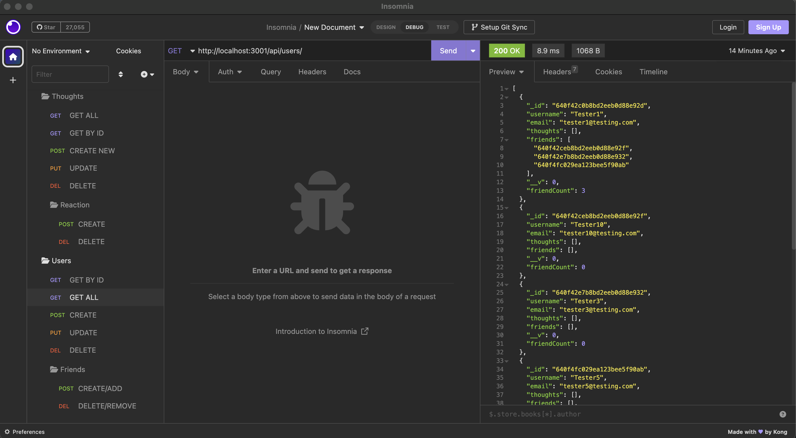
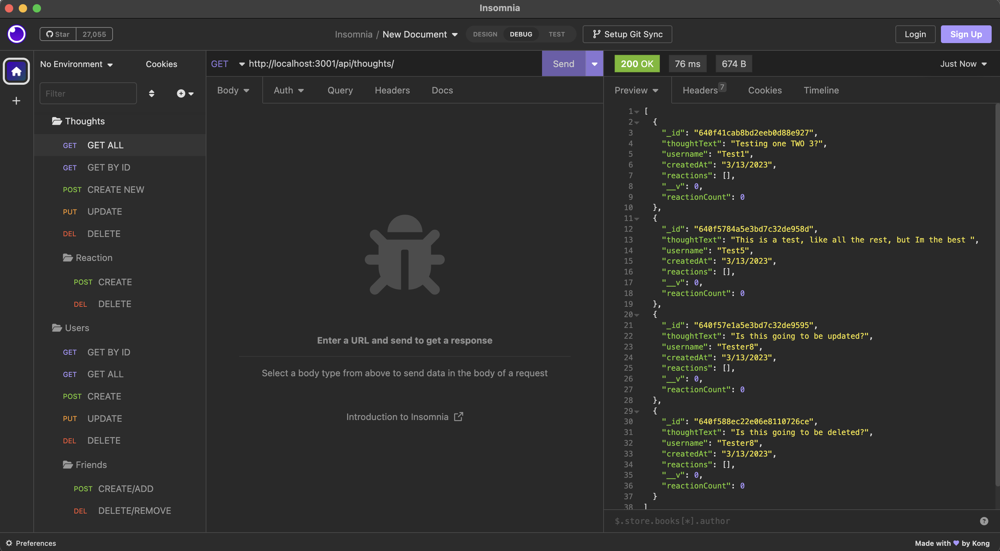
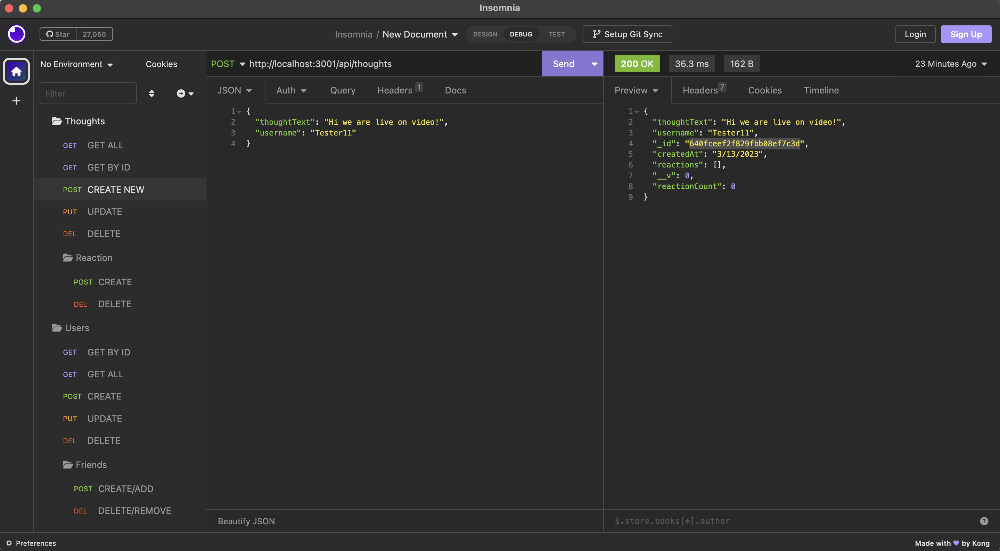
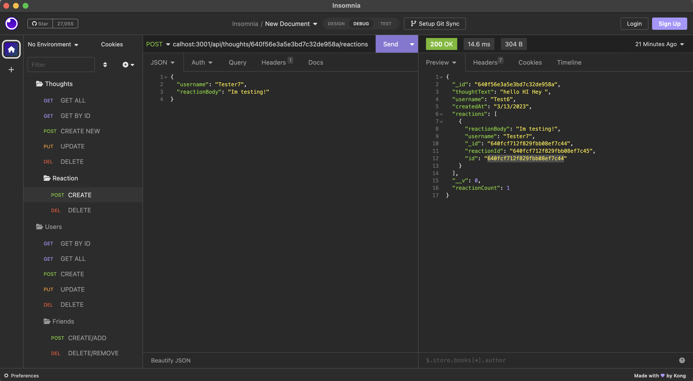
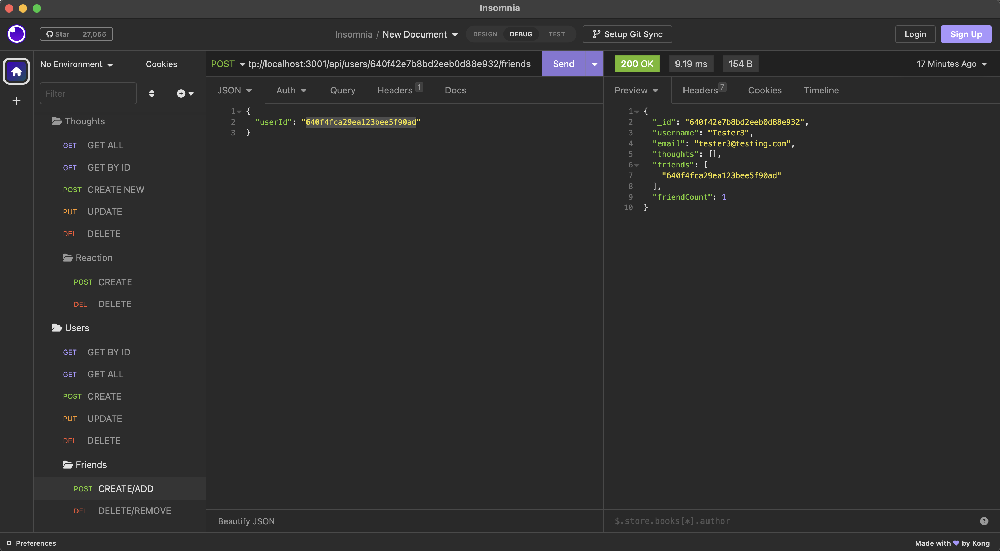

# networkingSocially
A social networking backend program.
# About
This project was to build a backend API for an application that functions like a social network. Where a user can add and remove friends, share thoughts and reactions to those thoughts. It uses the MongoDB to perform CRUD operations on the database

# Installation
To use this application the user must install the following:

Package.json  
Express  
Mongoose

# Description
This app is for anyone that wants to utilize mongoDB, express and mongoose along with an app like postman or insomnia to see the routes in action on their local host. You can use the different endpoints available to Create, Get, Update, Post and even Delete friends, thoughts and reactions.
# Mock-up
The following image shows the applications functionality and appearance.

# Links

## Github Repo
https://github.com/KyleKarotko/networkingSocially
## Link to the walk-through video
https://drive.google.com/file/d/1upM9vwxU8vmvxGl9kzWkyGUDjohopwB7/view